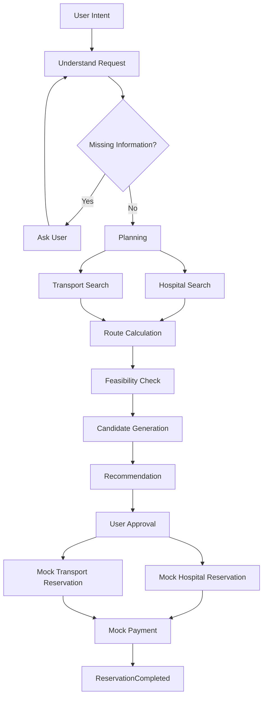
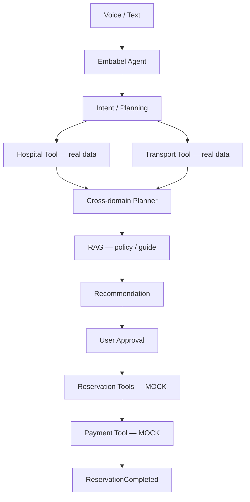

# Senior Life Booking Agent 프로젝트 명세

## 1. 제품 정의

시니어 사용자가 자연어 또는 음성으로 병원 방문이나 이동 요청을 말하면, AI Agent가 실시간 예약 정보를 탐색하고 병원·교통 일정의 실행 가능성을 판단해 최적 계획을 만든다. 사용자의 승인을 받은 뒤에만 Mock 예약과 Mock 결제를 수행하는 생활 예약 Agent다.
화면과 음성 입력, 정책 안내는 한국어와 영어를 지원한다.

## 2. 목표와 완료 조건

사용자가 “언제 어디로 가고 싶다” 또는 “어느 병원에 가고 싶다”고 말하면 다음 흐름을 완수한다.

1. 요청을 이해하고 필수 정보가 빠졌으면 질문한다.
2. 실시간 병원 및 교통 정보를 조회한다.
3. 이동 시간과 제약 조건을 함께 검증한다.
4. 실행 가능한 후보를 생성하고 비용을 포함해 추천한다.
5. 사용자에게 예약·결제 내역을 제시하고 승인을 받는다.
6. 승인 후 Mock 예약과 Mock 결제를 수행한다.
7. 완료 내역과 Mock 예약번호를 반환한다.

대표 성공 UX:

```text
User: 다음 주 수요일 오전에 서울대병원 정형외과 가고 싶어. 대전에서 갈 거야.

Agent: 10:30 진료와 08:10 KTX가 가장 적합합니다.
       진료비 예상: 30,000원
       교통비: 47,400원
       예약할까요?

User: 응

Agent: 예약 완료
       병원: 서울대병원 정형외과 / 진료: 10:30
       KTX: 대전 08:10 → 서울 09:21
       총 결제: 77,400원
       예약번호: DEMO-H8321
```

## 3. 실제 데이터와 Mock 경계

| 실제 데이터(Tool 조회) | Mock 실행 |
|---|---|
| 병원 정보와 위치 | 좌석 선점 |
| 진료과 | 병원 예약 확정 |
| 제공 가능한 경우의 예약 가능 정보 | 결제 |
| 기차·버스 운행 정보 | 예약번호 발급 |
| 가격과 이동 시간 | 결제 및 예약 취소 |
| 날씨 등 보조 정보 | |

실제 데이터의 조회 결과가 확정을 의미하지 않는다. 외부 시스템에 실제 예약·결제·취소 요청을 보내지 않는다.
현재 교통편 조회는 기차·시외버스·고속버스만 지원하며, 시내버스와 택시는 지원하지 않는다.
병원 조회 지역은 공공데이터 시·도 코드가 있는 서울·부산·인천·대구·광주·대전·울산·세종·경기·강원·충북·충남·전북·전남·경북·경남·제주만 지원한다.

## 4. Agent 흐름



## 5. 실행 가능성 판단과 재계획

진료 시각만 맞는다고 추천하지 않는다. 출발지부터 병원까지의 전체 이동 시간과 환승·도보 시간을 검증한다.

예: 10:30 진료에 대해 08:43 KTX가 09:55에 서울에 도착하고 병원까지 35분이 걸리면 여유 있게 도착할 수 없다. Agent는 “11:20 진료로 변경” 또는 “08:10 열차 이용”처럼 제약을 만족하는 대안을 제시하고, 사용자의 선택에 따라 다시 계획한다.

## 6. Human-in-the-loop 경계

Agent가 자율적으로 수행할 수 있는 작업:

- 검색
- 비교
- 계획
- 추천

반드시 사용자 승인이 필요한 작업:

- 병원 및 교통 예약
- 결제
- 취소

승인 요청에는 병원, 진료 시각, 교통편, 항목별 비용, 총액을 명확히 표시한다. 승인 전에는 `reserveHospital()`, `reserveTrain()`, `pay()` 또는 취소 작업을 호출하지 않는다. 변경된 후보나 금액에는 기존 승인을 재사용하지 않고 다시 승인받는다.

## 7. 실패와 보상 처리

### 예약 가능 시간 마감

승인 후 병원 예약이 “방금 예약 마감됨”으로 실패하면 다음 순서로 처리한다.

1. 최신 후보를 다시 조회한다.
2. 새 진료 시각을 찾는다.
3. 교통편과 이동 가능성을 다시 검증한다.
4. 비용과 일정을 갱신해 사용자에게 대안을 제시한다.
5. 새 승인을 받은 뒤 예약을 재시도한다.

### 부분 성공

병원 예약은 성공했지만 교통 예약이 실패하면 다른 교통편을 찾는다. 실행 가능한 대안이 없으면 이미 성공한 병원 예약을 Mock 취소하는 보상 작업을 수행한다.

```text
reserveHospital() -> success
reserveTrain() -> fail
findAlternativeTrain() -> no result
cancelHospitalReservation()
```

결제 실패에도 같은 원칙을 적용한다. 최종 상태가 성공인지, 실패인지, 보상 완료인지 사용자에게 분명히 알린다.

## 8. Tool과 RAG의 역할

Tool은 시점에 따라 변하는 정보를 조회한다.

- 현재 좌석
- 현재 예약 가능 시간
- 운행 시간
- 현재 가격

RAG는 비교적 안정적인 정책과 안내를 근거와 함께 답하는 데 사용한다.

- 할인 규정
- 취소 수수료
- 병원 이용 안내
- 진료 전 준비사항
- 교통 이용 규정

예: “MRI 촬영 전에 준비할 게 있나요?”는 병원 RAG, “이 표를 취소하면 수수료가 얼마인가요?”는 교통 RAG로 답한다.

## 9. 발표용 필수 시나리오

### Scenario A — 정상 예약

수요일 오전 서울대병원 정형외과 요청 → 병원·교통 조회 → 추천 → 승인 → Mock 예약·결제 성공.

### Scenario B — Constraint Conflict

10:30 진료와 “8시 이전 기차는 싫다” 조건이 충돌 → 불가능 사유를 설명하고 가능한 진료 시각 또는 교통편을 제안.

### Scenario C — Reservation Failure

승인한 10:30 진료가 예약 중 마감 → 재탐색 → 11:20 진료와 교통편 재검증 → 재승인 → 예약 완료.

## 10. 논리 아키텍처



## 11. 현재 구현 범위

현재는 Java 21, Spring Boot 4.1, Embabel Agent 1.5.0의 초기 빌드 설정과 애플리케이션 부팅 골격만 제공한다. 도메인 모델, Agent Action/Goal, 외부 데이터 Tool, RAG 저장소, 음성 UI, Mock 예약·결제는 후속 단계에서 필요한 만큼 구현한다.
