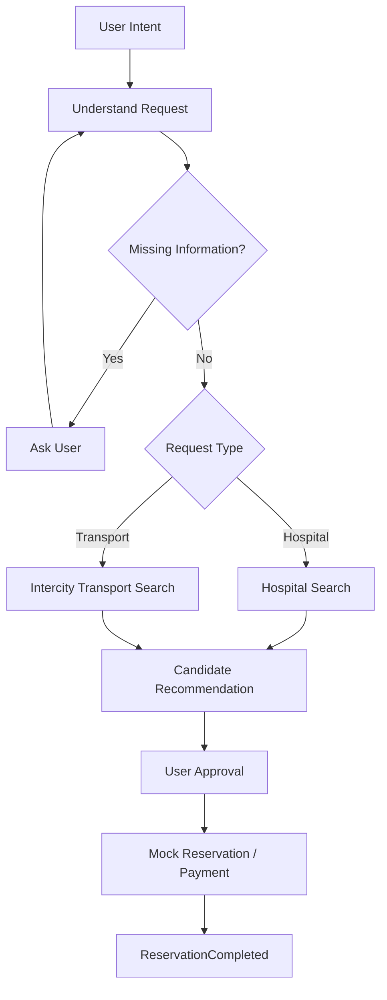
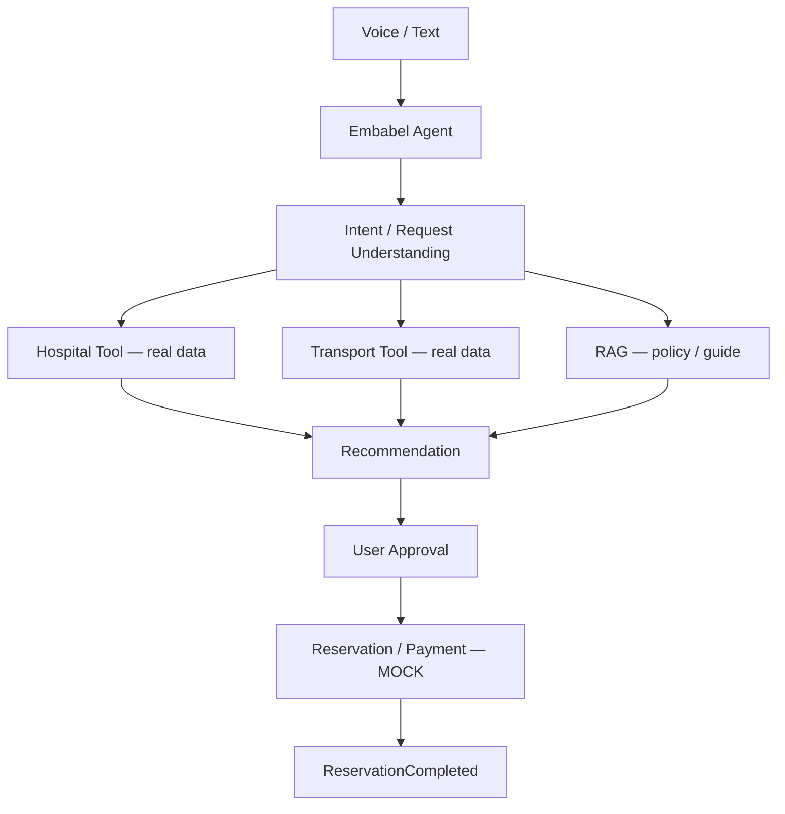

# Senior Life Booking Agent 프로젝트 명세

## 1. 제품 정의

시니어 사용자가 자연어 또는 음성으로 병원 예약이나 지역 간 이동 요청을 말하면, AI Agent가 실시간 정보를 탐색하고 적합한 후보를 제안한다. 사용자의 승인을 받은 뒤에만 Mock 예약과 Mock 결제를 수행하는 생활 예약 Agent다.
화면과 음성 입력, 정책 안내는 한국어와 영어를 지원한다.

## 2. 목표와 완료 조건

사용자가 “언제 어디로 가고 싶다” 또는 “어느 병원에 가고 싶다”고 말하면 다음 흐름을 완수한다.

1. 요청을 이해하고 필수 정보가 빠졌으면 질문한다.
2. 요청에 따라 실시간 병원 또는 교통 정보를 조회한다.
3. 시간과 비용 조건에 맞는 후보를 생성해 추천한다.
4. 사용자에게 예약·결제 내역을 제시하고 승인을 받는다.
5. 승인 후 Mock 예약과 Mock 결제를 수행한다.
6. 완료 내역과 Mock 예약번호를 반환한다.

대표 성공 UX:

```text
User: 다음 주 수요일 오전에 서울대병원 정형외과 가고 싶어.

Agent: 10:30 진료가 가능합니다.
       진료비 예상: 30,000원
       예약할까요?

User: 응

Agent: 예약 완료
       병원: 서울대병원 정형외과 / 진료: 10:30
       총 결제: 30,000원
       예약번호: DEMO-H8321
```

## 3. 실제 데이터와 Mock 경계

| 실제 데이터(Tool 조회) | Mock 실행 |
|---|---|
| 병원 정보와 위치 | 좌석 선점 |
| 진료과 | 병원 예약 확정 |
| 제공 가능한 경우의 예약 가능 정보 | 결제 |
| 기차·버스 운행 정보 | 예약번호 발급 |
| 가격과 이동 시간 | 결제 및 예약 취소 |
| 날씨 등 보조 정보 | |

실제 데이터의 조회 결과가 확정을 의미하지 않는다. 외부 시스템에 실제 예약·결제·취소 요청을 보내지 않는다.
현재 교통편 조회는 기차·시외버스·고속버스만 지원하며, 시내버스와 택시는 지원하지 않는다.
병원 조회 지역은 공공데이터 시·도 코드가 있는 서울·부산·인천·대구·광주·대전·울산·세종·경기·강원·충북·충남·전북·전남·경북·경남·제주만 지원한다.

## 4. Agent 흐름



## 5. 검색 범위와 재탐색

병원 예약과 지역 간 교통편은 독립적으로 검색하고 예약한다. 병원 예약 후 교통편을 이어서 찾으면 병원 주소와 진료 일시를 다시 입력하지 않고 재사용한다. 시내버스와 택시를 지원하지 않으므로 역이나 터미널에서 병원까지의 이동 시간은 계산하지 않으며 이를 사용자에게 명시한다. 선택한 후보가 마감되면 최신 정보를 다시 조회하고 같은 요청 범위에서 대안을 제시한다.

## 6. Human-in-the-loop 경계

Agent가 자율적으로 수행할 수 있는 작업:

- 검색
- 비교
- 계획
- 추천

반드시 사용자 승인이 필요한 작업:

- 병원 예약
- 교통 예약
- 결제
- 취소

승인 요청에는 해당 예약의 대상, 시간, 비용과 총액을 명확히 표시한다. 승인 전에는 예약, 결제 또는 취소 작업을 호출하지 않는다. 변경된 후보나 금액에는 기존 승인을 재사용하지 않고 다시 승인받는다.

## 7. 실패와 보상 처리

### 예약 가능 시간 마감

승인 후 병원 예약이 “방금 예약 마감됨”으로 실패하면 다음 순서로 처리한다.

1. 최신 후보를 다시 조회한다.
2. 새 진료 시각을 찾는다.
3. 비용과 일정을 갱신해 사용자에게 대안을 제시한다.
4. 새 승인을 받은 뒤 예약을 재시도한다.

병원과 교통 예약은 하나의 거래로 묶지 않는다. 각 예약이나 결제가 실패하면 실패 사실을 알리고 해당 종류의 후보만 재탐색한다.

## 8. Tool과 RAG의 역할

Tool은 시점에 따라 변하는 정보를 조회한다.

- 현재 좌석
- 현재 예약 가능 시간
- 운행 시간
- 현재 가격

RAG는 비교적 안정적인 정책과 안내를 근거와 함께 답하는 데 사용한다.

- 할인 규정
- 취소 수수료
- 병원 이용 안내
- 진료 전 준비사항
- 교통 이용 규정

예: “MRI 촬영 전에 준비할 게 있나요?”는 병원 RAG, “이 표를 취소하면 수수료가 얼마인가요?”는 교통 RAG로 답한다.

## 9. 발표용 필수 시나리오

### Scenario A — 정상 예약

수요일 오전 서울대병원 정형외과 요청 → 병원 조회 → 추천 → 승인 → Mock 예약·결제 성공.

### Scenario B — 교통편 검색

대전에서 서울까지 오전 이동 요청 → 기차·시외버스·고속버스 조회 → 시간과 비용 비교 → Mock 예약·결제 성공.

### Scenario C — Reservation Failure

승인한 10:30 진료가 예약 중 마감 → 재탐색 → 11:20 진료 제안 → 재승인 → 예약 완료.

## 10. 논리 아키텍처



## 11. 현재 구현 범위

현재는 병원 예약, 지역 간 교통편 예약, 정책 안내를 각각 독립된 Agent 흐름으로 제공한다. 병원과 교통 일정을 결합한 방문 계획은 지원하지 않는다.
